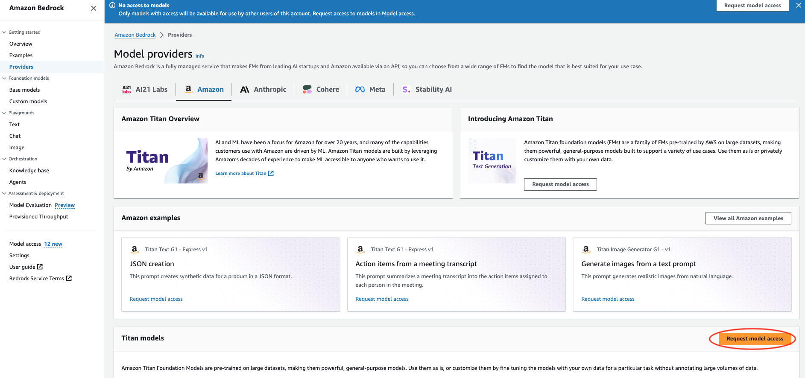
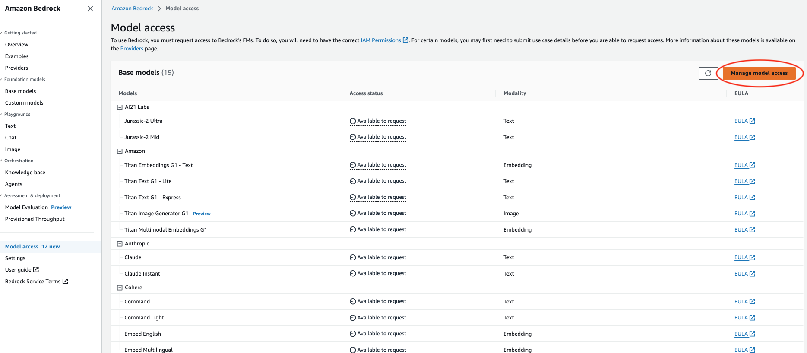
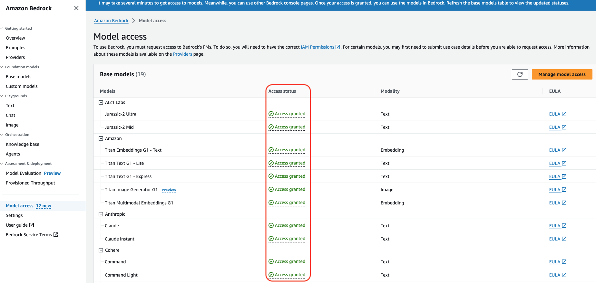
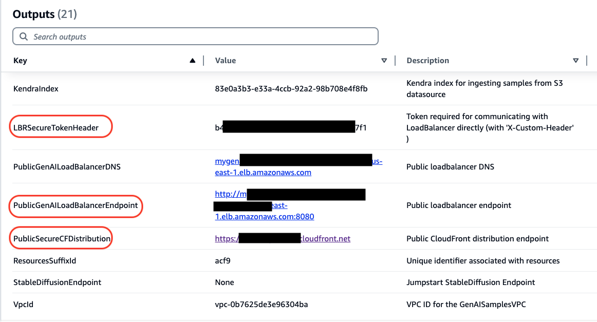
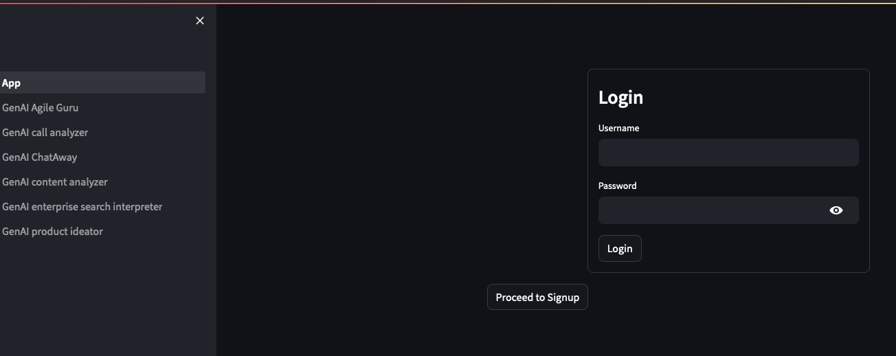
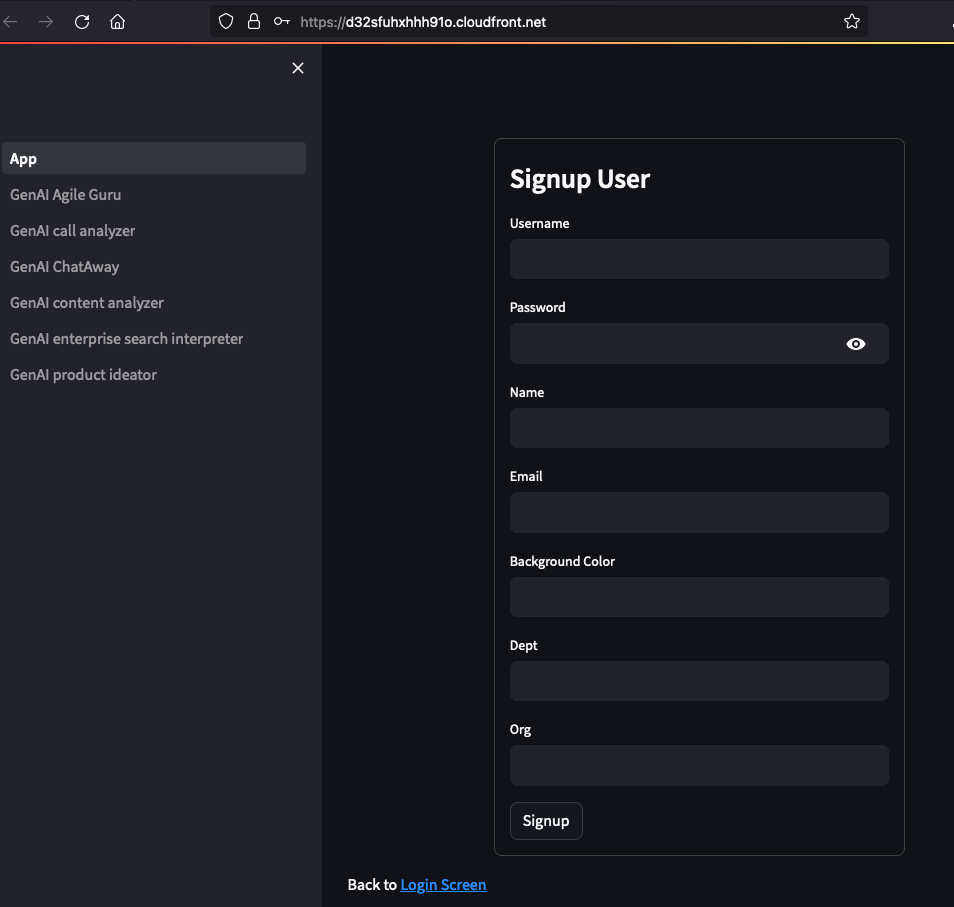
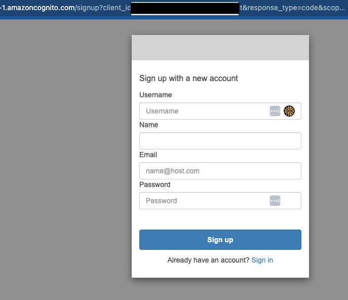
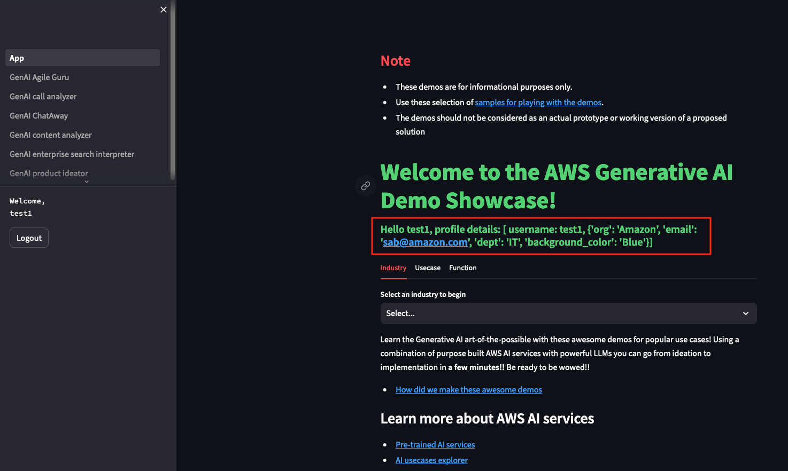
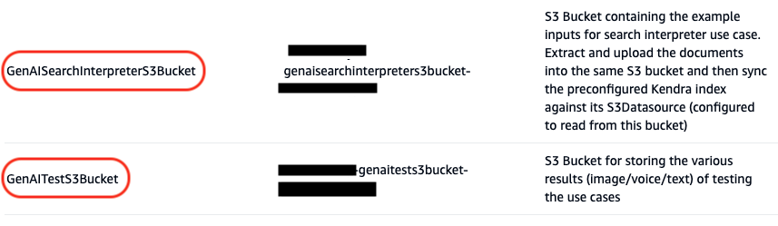

# README

## The AWS Gen AI Demo Showcase

This GenAI demo showcase consists of multiple demos which demonstrates the art of the possible with Generative AI using AWS services. We have started with 6 popular Gen AI demos demonstrating AWS AI services along with Amazon Bedrock. By deploying this solution, you can explore the power of these services and how they can be integrated to solve various business challenges.

## Design

The code for the demos is built with Python and calls API’s for various services in your AWS account. The front end  uses [Streamlit](https://streamlit.io/). The bundled code package is available in this Github repository <link> or as a standalone package. 

Users begin with a CloudFormation template that picks up the related sample application code package from a public repository or from an user managed S3 bucket specified in the input parameters. The stack then builds a Docker image using the code base on an EC2 instance it creates and uploads the docker image to Amazon ECR (Elastic Container Registry). The CloudFormation script then creates the additional infrastructure required like ECS Cluster, Fargate Task Definitions to run the docker image as a ECS managed container. Users can update the sources and deploy the package on Amazon ECS Fargate using the Code* tools ( Code Build, Code Commit, Code Pipeline and Code Deploy). 

The template then provisions additional services needed for the demos like IAM Roles, Kendra, Dynamo DB, S3 Buckets for sample data or storing test results, Amazon ALB and CloudFront to make the solution available via the web securely. The Sample Demo application would be accessible via CloudFront with user authentication managed by Cognito. 

In this version of the Demo Showcase, we have selected the most popular demos and we are supporting some of the Amazon Bedrock models only for the demos. In future versions, we will add additional models as well as demos.

Below is the architecture design of the solution:

Note: CICD setup is not included in this template.

## Deployment

* The deployment will handle the creation of the sample application running the demos inside ECS Fargate and exposed over ALB with CloudFront frontending it and leveraging Cognito to handle user authentication. We recommend deploying the stack in `us-east-1` or `us-west-2` as Bedrock models and various other dependent services are mostly available here, while other regions might lack them.

Note: This setup allows Cognito to redirect authenicated user over to CloudFront (that has a https endpoint). Its also possible to avoid CloudFront and have Cognito authenticate and redirect to ALB but this requires custom domain and additional steps of creation of certs, etc. Please refer to [cognito-user-pool-alb-authentication](https://repost.aws/knowledge-center/cognito-user-pool-alb-authentication) for more details.

### Application Stack Deployment

* To get started, download the Cloud Formation template [gen-ai-deploy-template](https://github.com/aws-samples/...gen-ai-deploy-template.yaml) YAML or JSON version from the “cloudformation” directory of the Github repository.<link>
* Log into to your AWS account where you will be deploying this solution. 
* The recommended region(s) for the first phase of deployment are us-east-1 or us-west-2 as these regions support all the Amazon Bedrock models currently. If you pick any other region, you will only see the available models of that region in the list of models to pick from in the menu on the left panel for each use case. Other dependent services might also not be available.

* The user deploying this solution should have or assume an administrator role when possible.  Admin privileges are required for the CFN script to build out the necessary roles, resources etc.
* Go to the CloudFormation service console.
* Select “Create Stack” > “with new resources” to create a new stack

* Under the “Specify Template” section, select “Upload  a template file” and upload the downloaded CloudFormation template from earlier. 

* On the next page, enter a unique name for the stack.

* In order to limit who can access the application, Cognito is configured to allow only specific domains to be accepted. Users who sign up have to match the allowed domains when they register their username and email address. Set the paramter *AllowedDomains* to match the list of allowed domains (can be comma separateed) for users registering. Use the *HostedUILoginURL* (would be in CloudFormation stack outputs tab) to signup for new user or use the app page to sign up as new user. Accessing the CloudFront Distribution endpoint and attempt to login will also show signup link.
* Cognito user sign up supports additional custom attributes as part of the user registration to identify users by their org/dept/preferences. Edit the parameter and references to it in the template as necessary in order to customize it.
* Provide a unique value for the *CognitoDomain* (so there is no overlap with any existing Cognito domains as it results in failure). Also, ensure the name does not contain *cognito* and no upper case letters.

* The **GenAIPublicGithubRepo** should point to the public Github repository hosting this sample project by default, if not please enter the path of a forked or internally hosted repository in that section.

* The CFN template needs to access the source code for the samples, from either the public repository or user-managed S3 bucket. The pre-bundled source code bundle is named as **gen-ai-code.zip** (referred to as **DemoSquadGenAICodeSampleZip** parameter).
    1. For the happy path with the publicly accessible repository, the CFN script would download the **gen-ai-code.zip** from the public Github repository and bootstap using the files for setting up the solution.
    2. If your account does not have access to the publicly hosted Github repository for any reason, download **gen-ai-code.zip** from public github repository separately and then upload it into a new S3 Bucket (in same region as where the solution is being deployed). This S3 bucket name is referred to as the **GenAICodeBootstrapBucketName** in the parameters section.  In this case of no access to the public Github repository, the CloudFormation script will download the same **gen-ai-code.zip** from the specified S3 bucket. Replace the default name of the bucket associated with the parameter **GenAICodeBootstrapBucketName** with the new name of the bucket you created in the CloudFormation form.

	**Note:** Download and copy over additional zips into the newly created S3 bucket from the Github repositary:

        Lambda zip files from lambdas folder (`sagemaker-jumpstart-deployer-lambda.zip` and `genai_call_neptune_lambda.zip`) of the public repository into the S3 bucket.
        Additionally, copy over the `GenAISampleArtifacts.zip` and `SearchInterpreter-Kendra.zip` files required for sample datasets into the root of the Bucket.
        

* The fields shown below can be edited to have unique names as needed. They refer to the label and version of the Docker image containing the Streamlit and sample application code to be run as Fargate container. The GenAISampleECRRepo parameter would refer to the repository to be created for hosting the container images.

* In this version, Sagemaker Jumpstart is not supported. So the below sections will not impact the deployment

* In this version, we are only supporting Amazon Bedrock Titan, Anthropic Claude, Meta Llama2, and AI21 Jurassic models. Future versions will support Sagemaker Jumpstart and other models. Default is set to Anthropic Claude for any Bedrock API interactions. You can change the default selection in the template. For one of the demos, Stable Diffusion XL 1.0 on Bedrock is supported.  

* As Sagemaker Jumpstart is not supported in this version, ignore these sections below. 

* Click “Next” through the remaining screens and acknowledge and “Submit” to start the deployment process. The deployment takes ~10-12 minutes to complete.
* Once the deployment is completed, check the Outputs tab of deployed app stack. 

* Key Outputs:
  * CognitoUserPoolID: cognito user pool created to manage user auth
  * ECSCluster: ECS Cluster created to run the application.
  * ECSService: ECS Service created to run the application.
  * DockerUpdateCommand: shell script to push updated code as docker image for ECS. Edit the parameters as necessary before running the script. Needs AWS CLI, credentials and Docker along with access to the application code (run from directory where the *Dockerfile* exists).
  * ECSUpdateCommand: shell script to update ECS to uptake any updated docker image or task definitions. Needs AWS CLI and credentials to update ECS.
  * GenAISearchInterpreterS3Bucket: S3 bucket that contains search contents that can indexed by Kendra.

  * HostedUILoginURL: Cognito Hosted UI Login and User Sign-up page  that would then redirect back to the Streamlit app (via CloudFront url)
  * LBRSecureTokenHeader: Token required to communicate with the ALB (pass as `X-Custom-Header`), if user wants to test bypassing CloudFront. CloudFront passes this header during its interaction with Loadbalancer. The user auth is separate and managed via Cognito.

* Check for the **GenAITestS3Bucket** key in the Outputs tab. This will refer to the newly created S3 bucket hosting readymade samples for the demo to utilize.
The Cloudformation script would have already copied over required samples into this bucket for a smooth working demo. 

* The following sample use cases are available in the first version of this solution.

* Check for the **KendraIndex** key in the Outputs tab. This refers to the new Kendra Index created. 
Go to Kendra service in console, locate the matching Kendra index and then select the Datasource (named GenAIKendraDatasource-*) on left hand panel and sync against with Kendra so it would ingest the Search interpreter demo sample contents. 
See Kendra documentation: https://docs.aws.amazon.com/kendra/latest/dg/data-source-s3.html for more details.

### Bedrock Model Access

Before running the sample application, ensure Bedrock Model access is enabled for the various models (Titan, Anthropic, Meta Llama etc.) by checking the Bedrock Service page in AWS console and requesting access in the specific region where you plan to deploy and test the sample application.
* To request access, visit the Providers page under [Bedrock Services](https://console.aws.amazon.com/bedrock)

* Click on the Manage access

Once all the models have been granted access, it should look like below

### Accessing the Streamlit application

Once the main stack is deployed with its CloudFront distribution, discover the deployed CloudFront distribution endpoint in the Outputs tab and access it in a new window. 
* `PublicSecureCFDistribution` is the link to the CloudFront distribution endpoint. 

This will launch the Gen AI Demo showcase as shown below with a Login form. This front end uses Streamlit. Login requires a valid user. 

* Use the signup button to create and register as a new user using the rendred UI. Also, one can use the Cognito Hosted UI to sign up but it does not support custom user attributes. The email domain needs to be in the allowed list (provided during stack creation). The email domain needs to be in the allowed list (provided during stack creation).

* Note: Also, one can use the Cognito Hosted UI to sign up but it does not support custom user attributes. 

* After a valid login, one should be able to see the Welcome page.

The custom attributes used during signup are displayed in the main page and can be used to differentiate users based on their profiles.

* For each of the usecase, users can select the model to run against by picking it from the drop down on the left panel.

	

## Testing
Read through the instructions on the Welcome page and navigate to the various available demos on the App page or using the menu on the Left. For those samples that require submitting a sample, kindly select the model on the left hand panel, selecting a sample from the list of samples and then hit submit button. The Streamlit application would report its RUNNING on the top right corner if its still processing. Switching between different models is supported where possible; do ensure you submit the input or prompt or upload sample data as necessary for invoking the model.

For the enterprise search, ensure Kendra service indexer is run against the sample artifacts so it can retrieve searches successfully.
Go to the Kendra service, select the Kendra index and run `Sync` against its S3 Datasource. This will make Kendra ingest the newly uploaded sample artifacts.
See Kendra documentation: https://docs.aws.amazon.com/kendra/latest/dg/data-source-s3.html for more details.

## Additional Notes
* Some of the demos require various input files. A set of sample input files are available inside the **GenAISamplesArtifacts.zip** and **SearchInterpreter-Kendra.zip**, under the **sample-artifacts** directory of the Github repo. The demos have been tested with these sample files. They are automatically unzipped and uploaded during deployment into the respective s3 buckets and folders. 
* You can use your own files as well, but as these are only demos, the results may not be the same as the with the sample files.
* For the two demos, "GenAI call analyzer" and "GenAI content analyzer": if you prefer to test with your sample dataset, upload them into the **GenAITestS3Bucket** S3 bucket and the respective directory in that bucket mapped to the corresponding demo(would be reported in the App Stack Outputs tab). For example, if you wish to the add you own sample recordings to the GenAI call analyzer demo, go the S3 bucket mapped to the **GenAITestS3Bucket** output in the CloudFormation outputs tab and click into the **call-analyzer-samples/** directory. Then upload your sample here. Go back to the demo page and refresh it. You should see your sample in the list of sample files. You can do the same for the **GenAI call analyzer** demo by uploading your samples in the **content-analyzer-samples** directory in the same bucket and refreshing the demo page. 
* The deployment had earlier uploaded the unzipped files from **SearchInterpreter-Kendra.zip** to the S3 Kendra Source bucket shown in the **Data Source** of the Kendra Index before running the Kendra Sync against the bucket. You can upload your own files into that bucket as well if you wish to use this demo to ask questions on your own dataset; re-run the Sync against Kendra again for the changes to be picked.
* For users interested in tweaking or modifying the code, fork the repo or copy over the repository and rebuild the docker image with updated sources using CI/CD to push the changes to Fargate.

Each demo has instructions and sample prompts to get started with. Please explore the art of the possible with this AWS Gen AI Demo Showcase.

### Testing with additional samples
There are two buckets created to hold sample data and artifacts. One is used by S3 for all content analyzer, call analyzer and other sample use cases while other bucket is used exclusively for Kendra Search.
Check the name of the buckets generated by visiting the CloudFormation Stack Outputs tab.

### To test with additional sample artifacts into S3:
  * Go to S3 bucket specified in the Outputs tab referred as `GenAITestS3Bucket`. It would have the following structure. Any new sample content can be copied over into the `content-analyzer-samples` folder. 

### To test with additional sample artifacts against Kendra:
  * Copy over additional sample data into the Kendra's S3 bucket (referred in the Outputs tab as `GenAISearchInterpreterS3Bucket` bucket.
  * Then go to the Kendra service, select the Kendra index and run `Sync` against its S3 Datasource. This will make Kendra ingest the newly uploaded sample artifacts.
See Kendra documentation: https://docs.aws.amazon.com/kendra/latest/dg/data-source-s3.html for more details.

## License
This sample code and templates are made available under a modified MIT license. 
See the LICENSE.md file for more information. 
