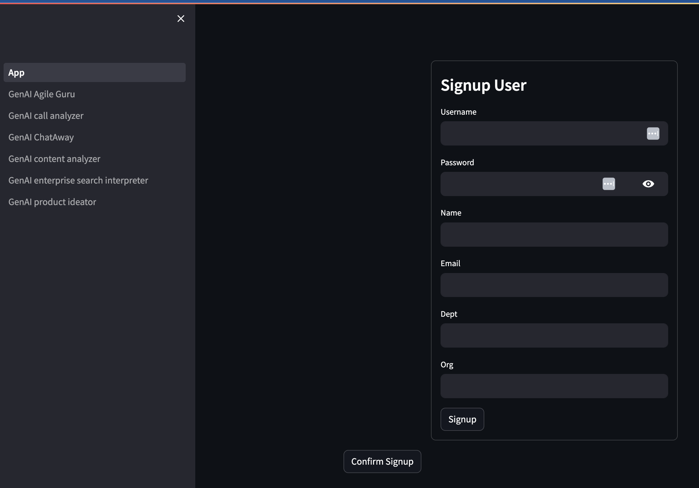
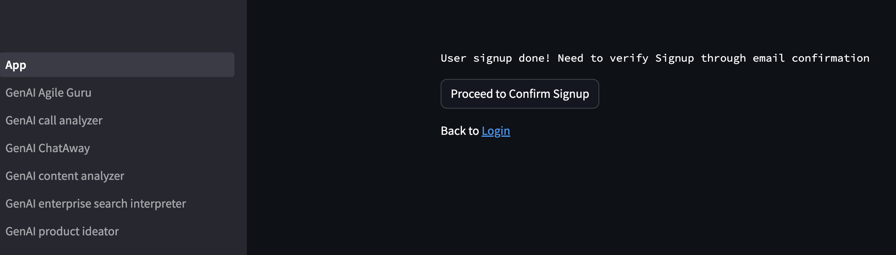
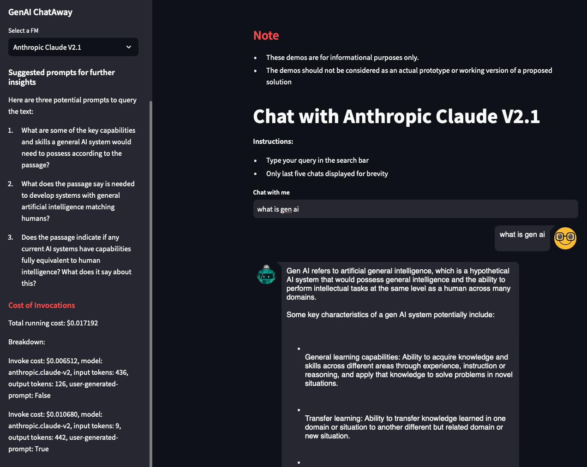
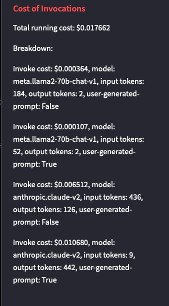

# Accessing the Streamlit Application

### Bedrock Model Access

Before running the sample application, ensure Bedrock Model access is enabled for the various models (Titan, Anthropic, Meta Llama etc.) by checking the Bedrock Service page in AWS console and requesting access in the specific region where you plan to deploy and test the sample application.
* To request access, visit the Providers page under [Bedrock Services](https://console.aws.amazon.com/bedrock)

* Click on the Manage access

Once all the models have been granted access, it should look like below

### Deployment Results
* Once the deployment is completed, check the Outputs tab of deployed app stack. 

* Key Outputs:
  * CognitoUserPoolID: cognito user pool created to manage user auth
  * ECSCluster: ECS Cluster created to run the application.
  * ECSService: ECS Service created to run the application.
  * GenAISearchInterpreterS3Bucket: S3 bucket that contains search contents that can indexed by Kendra.

If user is interested in modifying the samples or adding more customized usecases, this would recreation of the docker image of the streamlit app and uptaking it. There are two scripts available to recreate the ECS Docker image and push ECS to uptake the changed docker image. Edit the following scripts with correct region, stack id and run with AWS creds from command line.
  * `pushLatestDockerImage.sh`: shell script to push updated code as docker image for ECS. Edit the parameters as necessary before running the script. Needs AWS CLI, credentials and Docker along with access to the application code (run from directory where the *Dockerfile* exists).
  * `updateEcsService.sh`: shell script to update ECS to uptake any updated docker image or task definitions. Needs AWS CLI and credentials to update ECS.

  * HostedUILoginURL: Cognito Hosted UI Login and User Sign-up page  that would then redirect back to the Streamlit app (via CloudFront url)
  * LBRSecureTokenHeader: Token required to communicate with the ALB (pass as `X-Custom-Header`), if user wants to test bypassing CloudFront. CloudFront passes this header during its interaction with Loadbalancer. The user auth is separate and managed via Cognito.

* Check for the **GenAITestS3Bucket** key in the Outputs tab. This will refer to the newly created S3 bucket hosting readymade samples for the demo to utilize.
The Cloudformation script would have already copied over required samples into this bucket for a smooth working demo. 

* The following sample use cases are available in the first version of this solution.

* Check for the **KendraIndex** key in the Outputs tab. This refers to the new Kendra Index created. 
Go to Kendra service in console, locate the matching Kendra index and then select the Datasource (named GenAIKendraDatasource-*) on left hand panel and sync against with Kendra so it would ingest the Search interpreter demo sample contents. 
See Kendra documentation: https://docs.aws.amazon.com/kendra/latest/dg/data-source-s3.html for more details.

### Accessing the Streamlit application

Once the main stack is deployed with its CloudFront distribution, discover the deployed CloudFront distribution endpoint in the Outputs tab and access it in a new window. 
* `PublicSecureCFDistribution` is the link to the CloudFront distribution endpoint. 

This will launch the Gen AI Demo showcase as shown below with a Login form. This front end uses Streamlit. Login requires a valid user. 

* Use the signup button to create and register as a new user using the rendred UI. Also, one can use the Cognito Hosted UI to sign up but it does not support custom user attributes. The email domain needs to be in the allowed list (provided during stack creation). The email domain needs to be in the allowed list (provided during stack creation).

* There would be verification emailed for confirming the sign-up before the user can actually complete login. The email domain needs to match the domains (*AllowedDomains*) specified at stack creation.

Note: Also, one can use the Cognito Hosted UI to sign up but it does not support custom user attributes. 

* After a valid login, one should be able to see the Welcome page.

The custom attributes used during signup are displayed in the main page and can be used to differentiate users based on their profiles.

* For each of the usecase, users can select the model to run against by picking it from the drop down on the left panel.

	

## Cost Estimates
A sample estimate of the cost of invocation (for text based models) will be reported on the left hand panel based on published cost and token estimates along with a running total of estimated costs for the current session.

	
	

If the cost entry shows user-generated-prompt as True, it means the invocation was by done by user. If its false, then its auto-generated by the application (for coming up three or more auto-generated prompts). 
If the entry shows user-generated-prompt as False, it means the invocation was auto-generated by the application (for coming up three automatic prompts based on the output of the previous invocation). 

## Testing
Read through the instructions on the Welcome page and navigate to the various available demos on the App page or using the menu on the Left. For those samples that require submitting a sample, kindly select the model on the left hand panel, selecting a sample from the list of samples and then hit submit button. The Streamlit application would report its RUNNING on the top right corner if its still processing. Switching between different models is supported where possible; do ensure you submit the input or prompt or upload sample data as necessary for invoking the model.

For the enterprise search, ensure Kendra service indexer is run against the sample artifacts so it can retrieve searches successfully.
Go to the Kendra service, select the Kendra index and run `Sync` against its S3 Datasource. This will make Kendra ingest the newly uploaded sample artifacts.
See Kendra documentation: https://docs.aws.amazon.com/kendra/latest/dg/data-source-s3.html for more details.

## Additional Notes
* Some of the demos require various input files. A set of sample input files are available inside the **GenAISamplesArtifacts.zip** and **SearchInterpreter-Kendra.zip**, under the **sample-artifacts** directory of the Github repo. The demos have been tested with these sample files. They are automatically unzipped and uploaded during deployment into the respective s3 buckets and folders. 
* You can use your own files as well, but as these are only demos, the results may not be the same as the with the sample files.
* For the two demos, "GenAI call analyzer" and "GenAI content analyzer": if you prefer to test with your sample dataset, upload them into the **GenAITestS3Bucket** S3 bucket and the respective directory in that bucket mapped to the corresponding demo(would be reported in the App Stack Outputs tab). For example, if you wish to the add you own sample recordings to the GenAI call analyzer demo, go the S3 bucket mapped to the **GenAITestS3Bucket** output in the CloudFormation outputs tab and click into the **call-analyzer-samples/** directory. Then upload your sample here. Go back to the demo page and refresh it. You should see your sample in the list of sample files. You can do the same for the **GenAI call analyzer** demo by uploading your samples in the **content-analyzer-samples** directory in the same bucket and refreshing the demo page. 
* The deployment had earlier uploaded the unzipped files from **SearchInterpreter-Kendra.zip** to the S3 Kendra Source bucket shown in the **Data Source** of the Kendra Index before running the Kendra Sync against the bucket. You can upload your own files into that bucket as well if you wish to use this demo to ask questions on your own dataset; re-run the Sync against Kendra again for the changes to be picked.
* For users interested in tweaking or modifying the code, fork the repo or copy over the repository and rebuild the docker image with updated sources using CI/CD to push the changes to Fargate.

Each demo has instructions and sample prompts to get started with. Please explore the art of the possible with this AWS Gen AI Demo Showcase.

### Testing with additional samples
There are two buckets created to hold sample data and artifacts. One is used by S3 for all content analyzer, call analyzer and other sample use cases while other bucket is used exclusively for Kendra Search.
Check the name of the buckets generated by visiting the CloudFormation Stack Outputs tab.

### To test with additional sample artifacts into S3:
  * Go to S3 bucket specified in the Outputs tab referred as `GenAITestS3Bucket`. It would have the following structure. Any new sample content can be copied over into the `content-analyzer-samples` folder. 

### To test with additional sample artifacts against Kendra:
  * Copy over additional sample data into the Kendra's S3 bucket (referred in the Outputs tab as `GenAISearchInterpreterS3Bucket` bucket.
  * Then go to the Kendra service, select the Kendra index and run `Sync` against its S3 Datasource. This will make Kendra ingest the newly uploaded sample artifacts.
See Kendra documentation: https://docs.aws.amazon.com/kendra/latest/dg/data-source-s3.html for more details.

