# Install

* AWS CloudFormation template used for deployment will handle the creation of the sample application running the demos inside ECS Fargate and exposed over ALB with CloudFront frontending it and leveraging Cognito to handle user authentication. We recommend deploying the stack in `us-east-1` or `us-west-2` as Bedrock models and various other dependent services are mostly available here, while other regions might lack them.

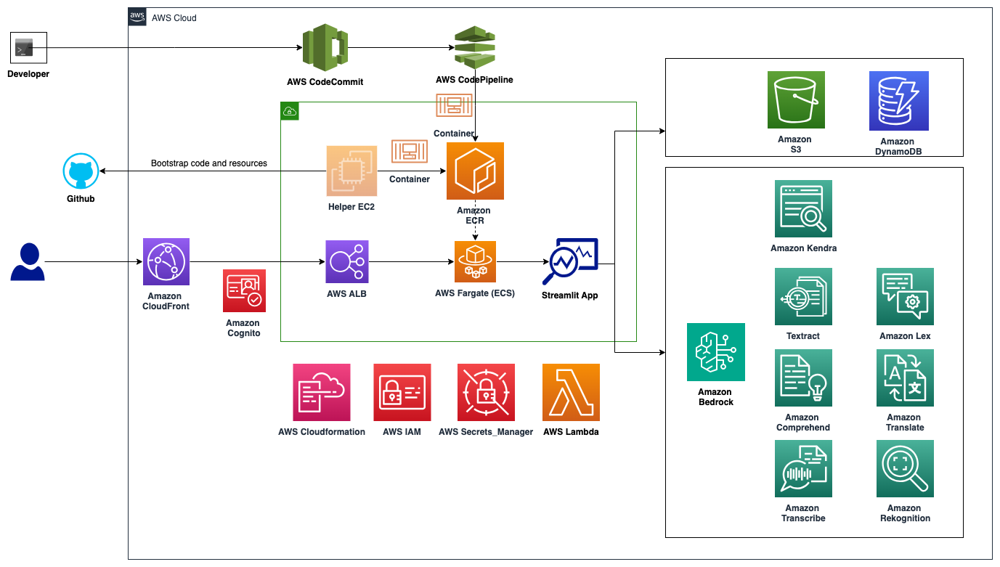

Note: This setup allows Cognito to redirect authenicated user over to CloudFront (that has a https endpoint). Its also possible to avoid CloudFront and have Cognito authenticate and redirect to ALB but this requires custom domain and additional steps of creation of certs, etc. Please refer to [cognito-user-pool-alb-authentication](https://repost.aws/knowledge-center/cognito-user-pool-alb-authentication) for more details.

### Application Stack Deployment

* To get started, download the Cloud Formation template [gen-ai-deploy-template](https://github.com/aws-samples/...gen-ai-deploy-template.yaml) YAML or JSON version from the “cloudformation” directory of the Github repository.<link>
* Log into to your AWS account where you will be deploying this solution. 
* The recommended region(s) for the first phase of deployment are us-east-1 or us-west-2 as these regions support all the Amazon Bedrock models currently. If you pick any other region, you will only see the available models of that region in the list of models to pick from in the menu on the left panel for each use case. Other dependent services might also not be available.

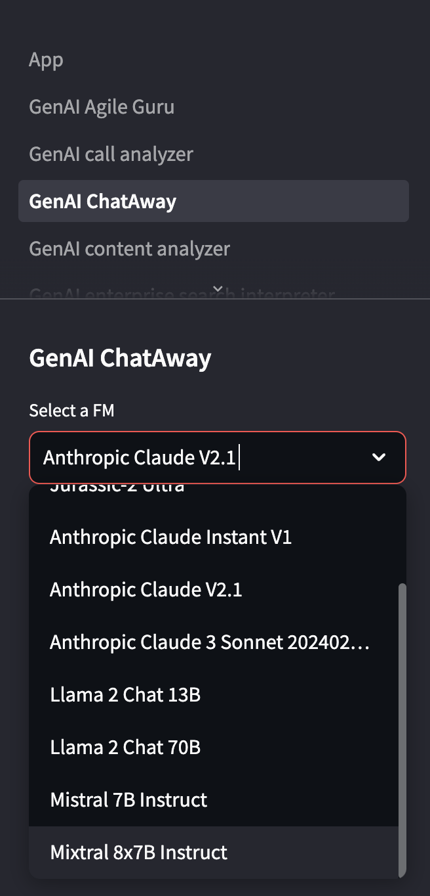

* The user deploying this solution should have or assume an administrator role when possible.  Admin privileges are required for the CFN script to build out the necessary roles, resources etc.
* Go to the CloudFormation service console.
* Select “Create Stack” > “with new resources” to create a new stack

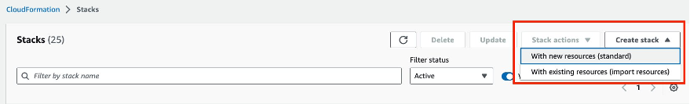

* Under the “Specify Template” section, select “Upload  a template file” and upload the downloaded CloudFormation template from earlier. 
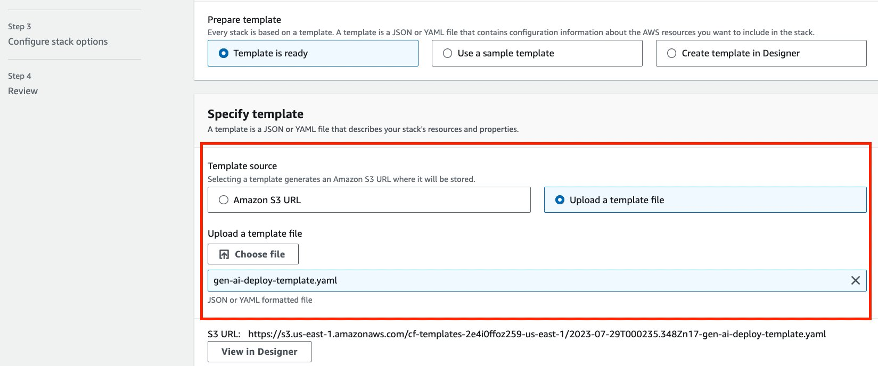

* On the next page, enter a unique name for the stack.

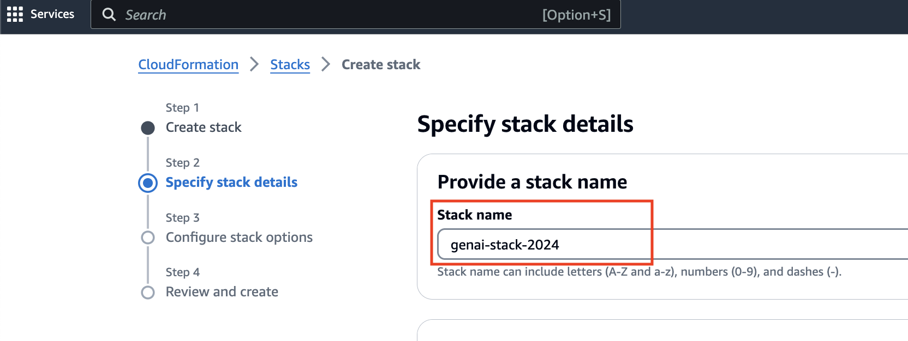
* In order to limit who can access the application, Cognito is configured to allow only specific domains to be accepted. Users who sign up have to match the allowed domains when they register their username and email address. Set the paramter *AllowedDomains* to match the list of allowed domains (can be comma separateed) for users registering. Use the *HostedUILoginURL* (would be in CloudFormation stack outputs tab) to signup for new user or use the app page to sign up as new user. Accessing the CloudFront Distribution endpoint and attempt to login will also show signup link.
* Cognito user sign up supports additional custom attributes as part of the user registration to identify users by their org/dept/preferences. Edit the parameter and references to it in the template as necessary in order to customize it.
* Provide a unique value for the *CognitoDomain* (so there is no overlap with any existing Cognito domains as it results in failure). Also, ensure the name does not contain *cognito* and no upper case letters.
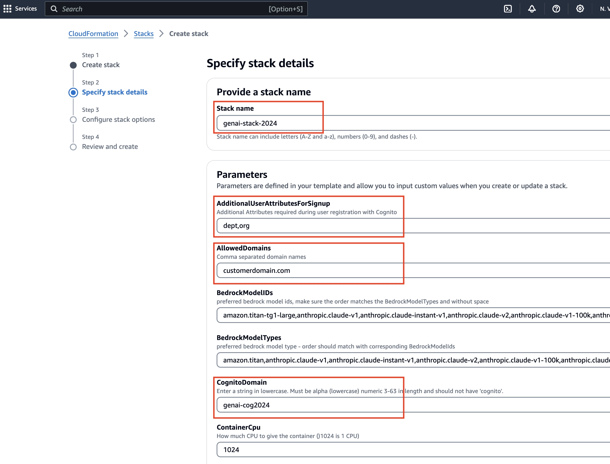
* The **GenAIPublicGithubRepo** should point to the Github repository hosting this sample project by default, if not please enter the path of a forked or internally hosted repository in that section.

* The CFN template needs to access the source code for the samples, from either a github repository or from a user-managed S3 bucket. The pre-bundled source code bundle is expected to be named as **gen-ai-code.zip** (referred to as **DemoSquadGenAICodeSampleZip** parameter).
    1. For the happy path with the accessible repository, the CFN script would download the source code from the Github repository and bootstap using the files for setting up the solution.
    2. If your account does not have access to the publicly hosted Github repository for any reason, or unable to create private Github connections from CloudFormation, or want to deploy with custom modified sources, create **gen-ai-code.zip** from github repository separately (using `create-gen-ai-repo-zip.sh`)and then upload it into a new S3 Bucket (in same region as where the solution is being deployed). This S3 bucket name is referred to as the **GenAICodeBootstrapBucketName** in the parameters section.  In this case of no access to Github repository, the CloudFormation script will download the code in zip format ( **gen-ai-code.zip**) from the specified S3 bucket. Replace the default name of the bucket associated with the parameter **GenAICodeBootstrapBucketName** with the new name of the bucket you created in the CloudFormation form.

	**Note:** Create and copy over the **gen-ai-code.zip** zip into the newly created S3 bucket from the Github repositary:

        
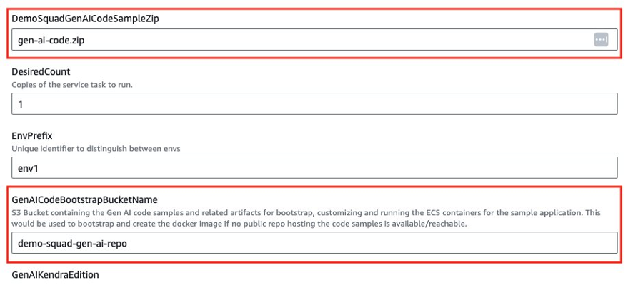

* The fields shown below can be edited to have unique names as needed. They refer to the label and version of the Docker image containing the Streamlit and sample application code to be run as Fargate container. The GenAISampleECRRepo parameter would refer to the repository to be created for hosting the container images.

* In this version, AWS Sagemaker Jumpstart is not supported. So the below sections will not impact the deployment

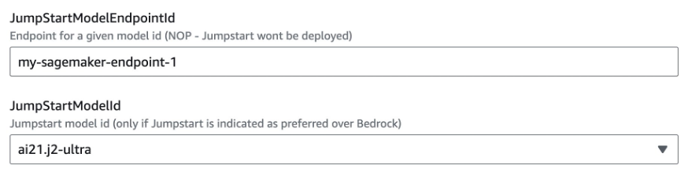
* In this version, we are only supporting Amazon Bedrock Titan, Anthropic Claude, Meta Llama2, and AI21 Jurassic models. Future versions will support Sagemaker Jumpstart and other models. Default is set to Anthropic Claude for any Bedrock API interactions. You can change the default selection in the template. For one of the demos, Stable Diffusion XL 1.0 on Bedrock is supported.  

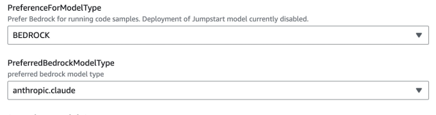

* As Sagemaker Jumpstart is not supported in this version, ignore these sections below. 

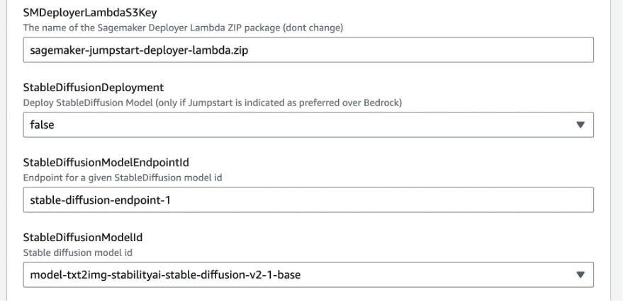
* Click “Next” through the remaining screens and acknowledge and “Submit” to start the deployment process. The deployment takes ~10-12 minutes to complete.
* Once the deployment is completed, check the Outputs tab of deployed app stack. 

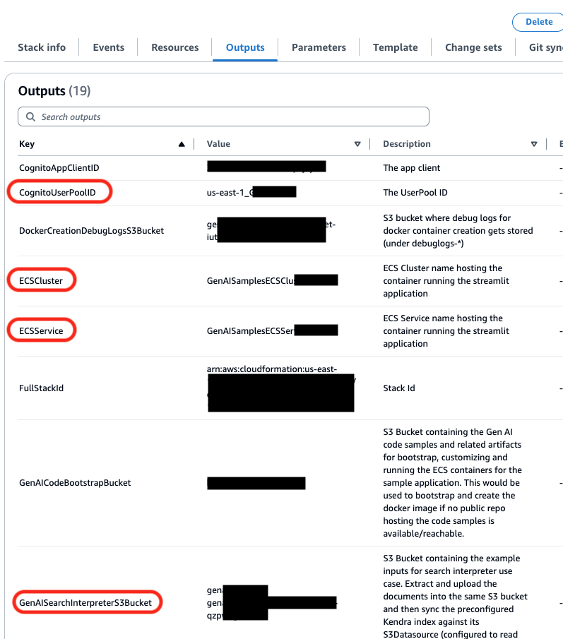
* Key Outputs:
  * CognitoUserPoolID: cognito user pool created to manage user auth
  * ECSCluster: ECS Cluster created to run the application.
  * ECSService: ECS Service created to run the application.
  * GenAISearchInterpreterS3Bucket: S3 bucket that contains search contents that can indexed by Kendra.

If user is interested in modifying the samples or adding more customized usecases, this would recreation of the docker image of the streamlit app and uptaking it. There are two scripts available to recreate the ECS Docker image and push ECS to uptake the changed docker image. Edit the following scripts with correct region, stack id and run with AWS creds from command line.
  * `pushLatestDockerImage.sh`: shell script to push updated code as docker image for ECS. Edit the parameters as necessary before running the script. Needs AWS CLI, credentials and Docker along with access to the application code (run from directory where the *Dockerfile* exists).
  * `updateEcsService.sh`: shell script to update ECS to uptake any updated docker image or task definitions. Needs AWS CLI and credentials to update ECS.

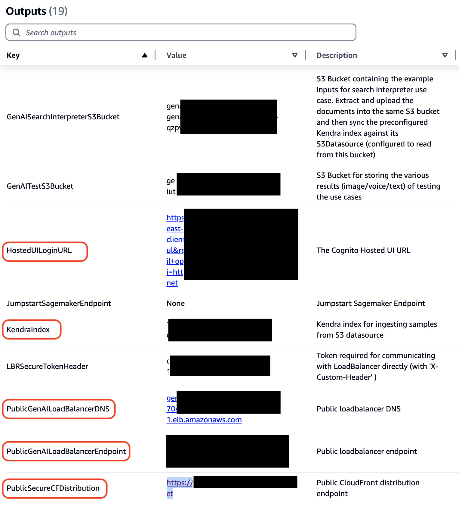
  * HostedUILoginURL: Cognito Hosted UI Login and User Sign-up page  that would then redirect back to the Streamlit app (via CloudFront url)
  * LBRSecureTokenHeader: Token required to communicate with the ALB (pass as `X-Custom-Header`), if user wants to test bypassing CloudFront. CloudFront passes this header during its interaction with Loadbalancer. The user auth is separate and managed via Cognito.

* Check for the **GenAITestS3Bucket** key in the Outputs tab. This will refer to the newly created S3 bucket hosting readymade samples for the demo to utilize.
The Cloudformation script would have already copied over required samples into this bucket for a smooth working demo. 
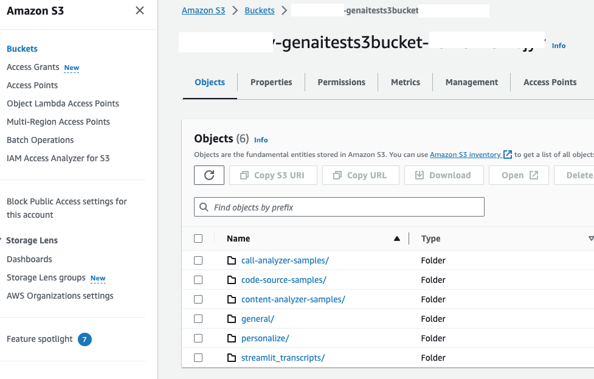

* The following sample use cases are available in the first version of this solution.
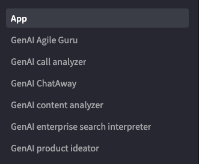

* Check for the **KendraIndex** key in the Outputs tab. This refers to the new Kendra Index created. 
Go to Kendra service in console, locate the matching Kendra index and then select the Datasource (named GenAIKendraDatasource-*) on left hand panel and sync against with Kendra so it would ingest the Search interpreter demo sample contents. 
See Kendra documentation: https://docs.aws.amazon.com/kendra/latest/dg/data-source-s3.html for more details.

### Customizing the samples
If user is interested in modifying the samples or adding more customized usecases, this would recreation of the docker image of the streamlit app and uptaking it. There are two scripts available to recreate the ECS Docker image and push ECS to uptake the changed docker image. Edit the following scripts with correct region, stack id and run with AWS creds from command line.
  * `pushLatestDockerImage.sh`: shell script to push updated code as docker image for ECS. Edit the parameters as necessary before running the script. Needs AWS CLI, credentials and Docker along with access to the application code (run from directory where the *Dockerfile* exists).
  * `updateEcsService.sh`: shell script to update ECS to uptake any updated docker image or task definitions. Needs AWS CLI and credentials to update ECS.

There are two helper utiltiies that encapsulate the interactions with Bedrock and Cognito. [utils/gen_ai_selector.py](../utils/gen_ai_selector.py) handles the model selection and invocation of various Bedrock models and [utils/cognito_helper.py](../utils/cognito_helper.py) handles the user registration/signup, authentication.

